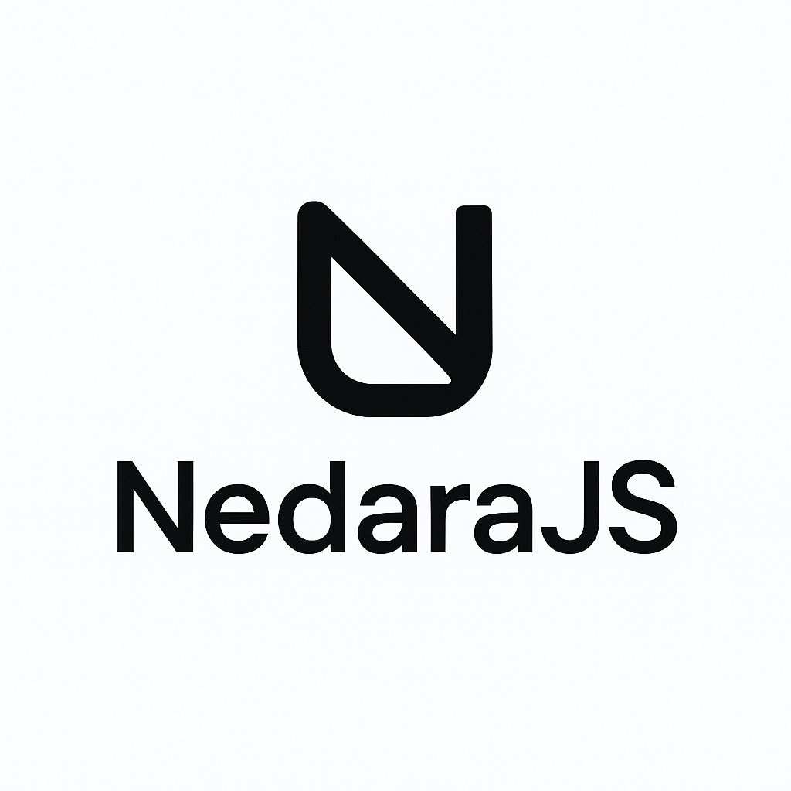

# Nedara JavaScript Framework

<p align="center">
 
</p>

A lightweight, easy-to-use JavaScript framework for web development that brings you back to the essentials.

You can find an example application here: [NedaraJS Demo](https://github.com/Nedara-Project/nedarajs-demo)

### Public applications or projects made with NedaraJS

- [Nedara LWS](https://github.com/Nedara-Project/nedara-lws) > Linux Web Service Manager
- [Nedara Monitoring](https://github.com/Nedara-Project/nedara-monitoring) > Linux and PostgreSQL Server Monitoring
- [RandomDraw](https://randomdraw.io) > Real-time Collaborative Random Draw Tool
- [Plob](https://plob.io) > Real-time file sharing with no external servers

...and more 🤠

## Table of Contents

1. [Overview](#overview)
2. [Features](#features)
3. [Installation](#installation)
4. [Basic Usage](#basic-usage)
   - [Creating a Widget](#creating-a-widget)
   - [Template System](#template-system)
5. [Template Syntax](#template-syntax)
   - [Variables](#variables)
   - [Loops](#loops)
   - [Conditionals](#conditionals)
   - [Nested Loops](#nested-loops)
   - [Nested Conditionals](#nested-conditionals)
6. [API Reference](#api-reference)
   - [Core Methods](#core-methods)
   - [Widget Object](#widget-object)
7. [Complete Examples](#complete-examples)
8. [DOM Utility — Nedara.el()](#dom-utility--nedarael)
9. [Dependencies](#dependencies)
10. [Limitations and Extensions](#limitations-and-extensions)
11. [Contributing](#contributing)
12. [License](#license)

## Overview

Nedara JS is a minimalist JavaScript framework designed to simplify widget management in web applications. In a world where many frameworks over-complicate development, Nedara offers a refreshing return to the core principles of web programming while providing powerful functionality in a compact package.

## Features

- **Lightweight**: Minimal footprint with just what you need
- **Intuitive Widget System**: Easily create, manage, and extend UI components
- **Powerful Templating**: Built-in template rendering with support for loops and conditionals
- **Event Management**: Simplified event binding and handling
- **Zero Dependencies**: No jQuery or any other external library required
- **Built-in DOM Utility**: `Nedara.el()` provides a lightweight element wrapper for common operations

## Installation

Include Nedara in your project — no external dependencies required:

```html
<script type="module" src="path/to/nedara.js"></script>
```

## Basic Usage

### Creating a Widget

```javascript
const myWidget = Nedara.createWidget({
    selector: "#my-container",
    events: {
        "click .button": "_onButtonClick",
        "change .input": "_onInputChange"
    },

    start: function() {
        // Initialize your widget
        console.log("Widget started!");
    },

    _onButtonClick: function(ev) {
        console.log("Button clicked!");
    },

    _onInputChange: function(ev) {
        console.log("Input changed!");
    }
});

// Register the widget if needed for later reuse
Nedara.registerWidget("myWidget", myWidget);
```

### Template System

First, import your templates:

```javascript
const TEMPLATES = "/path/to/templates.html";

// Import templates
await Nedara.importTemplates(TEMPLATES);
```

This loads the HTML template file provided from your source folder.

Then use them in your application:

```javascript
// Simple variable rendering
const html = Nedara.renderTemplate("user_card", {
    name: "John Doe",
    email: "john@example.com"
});

// Conditional rendering
const html = Nedara.renderTemplate("notification", {
    isError: true,
    message: "Something went wrong"
});

// Loop rendering
const html = Nedara.renderTemplate("user_list", {
    users: [
        { name: "John", id: 1 },
        { name: "Jane", id: 2 }
    ]
});
```

Example of template definition:

```html
<template id="user_card">
    <div>
        <span>{{name}} - {{email}}</span>
    </div>
</template>
```

## Template Syntax

Nedara supports a powerful templating system with variables, loops, and conditionals.

### Variables

Simple placeholders for dynamic content with support for object path access.

By default, values are **HTML-escaped** to prevent XSS. Use triple braces `{{{var}}}` to inject raw HTML:

```html
<p>Hello, {{recipient.name}}!</p>
<p>Your email is: {{recipient.email}}</p>
<div>{{{recipient.bio}}}</div>  <!-- raw HTML, not escaped -->
```

```javascript
Nedara.renderTemplate("greeting", {
    recipient: {
        name: "John Doe",
        email: "john@example.com",
        bio: "<strong>Developer</strong>",
    }
});
// Output: <p>Hello, John Doe!</p><p>Your email is: john@example.com</p>
//         <div><strong>Developer</strong></div>
```

> **Note:** Variables that have no matching key in `data` render as an empty string.

### Loops

Iterate over arrays of data:

```html
<ul>
  {{#items}}
    <li>{{name}} - {{price}}</li>
  {{/items}}
</ul>
```

```javascript
Nedara.renderTemplate("product_list", {
    items: [
        { name: "Product 1", price: "$10" },
        { name: "Product 2", price: "$20" }
    ]
});
// Output: <ul><li>Product 1 - $10</li><li>Product 2 - $20</li></ul>
```

### Conditionals

Display content based on conditions with support for expressions:

```html
{{#if isAdmin}}
  <button>Admin Actions</button>
{{else}}
  <p>You don't have permission</p>
{{/if}}

{{#if user.role === 'editor'}}
  <button>Edit Content</button>
{{else}}
  <p>No access granted</p>
{{/if}}

{{#if items.length}}
  <p>There are {{items.length}} items available</p>
{{else}}
  <p>No items found</p>
{{/if}}
```

```javascript
Nedara.renderTemplate("user_actions", {
    isAdmin: true,
    user: { role: 'editor' },
    items: [1, 2, 3]
});
```

### Nested Loops

Combine loops for more complex structures:

```html
<div>
  {{#categories}}
    <h2>{{name}}</h2>
    <ul>
      {{#items}}
        <li>{{name}}</li>
      {{/items}}
    </ul>
  {{/categories}}
</div>
```

```javascript
Nedara.renderTemplate("catalog", {
    categories: [
        {
            name: "Electronics",
            items: [
                { name: "Phone" },
                { name: "Laptop" }
            ]
        },
        {
            name: "Books",
            items: [
                { name: "Fiction" },
                { name: "Non-fiction" }
            ]
        }
    ]
});
```

### Nested Conditionals

Use nested conditionals with `subif` and `subelse`:

```html
{{#if user.loggedIn}}
  <div class="user-panel">
    <p>Welcome, {{user.name}}!</p>

    {{#subif user.role === 'admin'}}
      <div class="admin-section">
        <h3>Admin Dashboard</h3>
      </div>
    {{/subif}}

    <button>Logout</button>
  </div>
{{else}}
  <div class="login-prompt">
    <p>Please log in to continue</p>
    <button>Login</button>
  </div>
{{/if}}
```

```javascript
Nedara.renderTemplate("user_interface", {
    user: {
        loggedIn: true,
        name: "John Doe",
        role: "admin"
    },
});
```

## API Reference

### Core Methods

#### `Nedara.importTemplates(url)`
Imports templates from the specified URL.
- **Parameters:**
  - `url` - Path to the template file
- **Returns:** A Promise that resolves when templates are loaded

#### `Nedara.renderTemplate(id, data)`
Renders a template with the provided data.
- **Parameters:**
  - `id` - The ID of the template to render
  - `data` - An object containing the data to inject into the template
- **Returns:** A string containing the rendered HTML

#### `Nedara.registerWidget(name, widgetObject)`
Registers a widget for later use.
- **Parameters:**
  - `name` - Unique name for the widget
  - `widgetObject` - The widget object to register

#### `Nedara.createWidget(options)`
Creates a new widget instance with the provided options.
- **Parameters:**
  - `options` - Configuration object for the widget
- **Returns:** The created widget instance

### Widget Object

#### Properties
- `container`: The DOM element containing the widget (default: `document`)
- `selector`: CSS selector for the widget's root element
- `events`: Object mapping event selectors to handler methods

#### Methods
- `init()`: Initializes the widget
- `start()`: Called after initialization
- `end()`: Called before destruction
- `refresh()`: Refreshes event bindings
- `destroy()`: Cleans up the widget
- `extend(extensions)`: Creates a new widget extending the current one

## Complete Examples

### Basic Widget with Template Integration

```javascript
'use strict';

import Nedara from './nedara.js';

const navigationWidget = Nedara.createWidget({
    selector: '.navigation-container',
    events: {
        'click .nav-link': '_onNavLinkClick',
    },

    start: function() {
        console.log('Navigation widget initialized');

        Nedara.importTemplates('/static/templates.html').then(() => {
            const navHtml = Nedara.renderTemplate('navigation_template', {
                brand: 'My Website',
                items: [
                    {url: '/home', text: 'Home', active: true},
                    {url: '/about', text: 'About', active: false},
                    {url: '/contact', text: 'Contact', active: false},
                ],
                showUserMenu: true,
                user: {
                    name: 'John Doe',
                    role: 'Admin'
                }
            });

            this.$selector.html(navHtml);
        });
    },

    _onNavLinkClick: function(ev) {
        ev.preventDefault();
        const link = ev.currentTarget;
        console.log('Navigation to:', link.getAttribute('href'));

        // Update active state
        this.$selector.find('.nav-link').removeClass('active');
        link.classList.add('active');

        // Additional navigation logic...
    }
});

Nedara.registerWidget('navigationWidget', navigationWidget);
```

### Workflow Management Widget

```javascript
import Nedara from "./nedara.js";

const TEMPLATES = "/path/to/templates.html";

const workflowWidget = Nedara.createWidget({
    selector: "#workflow_container",
    events: {
        "change .name-input": "_onNameChange",
        "click .add-field": "_onAddFieldClick",
        "click .remove-field": "_onRemoveFieldClick",
        "change .field-type": "_onFieldTypeChange"
    },

    start: function() {
        this.workflowData = {
            name: "",
            techName: "",
            fields: {}
        };

        Nedara.importTemplates(TEMPLATES).then(() => {
            this._refreshUI();
        });
    },

    _adaptTechName: function(name) {
        return name.toLowerCase()
            .replace(/\s+/g, "_")
            .replace(/[^a-z0-9_]/g, "");
    },

    _onNameChange: function(ev) {
        const name = ev.currentTarget.value;
        const techName = this._adaptTechName(name);

        this.workflowData.name = name;
        this.workflowData.techName = techName;

        this.$selector.find('.tech-name-display').text(techName);
    },

    _onAddFieldClick: function() {
        const fieldId = "field_" + Date.now();
        this.workflowData.fields[fieldId] = {
            name: "New Field",
            techName: "new_field",
            type: "text",
            required: false
        };
        this._refreshUI();
    },

    _onRemoveFieldClick: function(ev) {
        const fieldId = ev.currentTarget.closest('.field-item').dataset.fieldId;
        delete this.workflowData.fields[fieldId];
        this._refreshUI();
    },

    _onFieldTypeChange: function(ev) {
        const field = Nedara.el(ev.currentTarget.closest('.field-item'));
        const fieldId = field.data('fieldId');
        const fieldType = ev.currentTarget.value;

        this.workflowData.fields[fieldId].type = fieldType;

        // Show/hide relational field options
        field.find('.relational-options').toggle(
            ['m2o', 'o2m'].includes(fieldType)
        );
    },

    _refreshUI: function() {
        const html = Nedara.renderTemplate("workflow_editor", this.workflowData);
        this.$selector.html(html);
    }
});

Nedara.registerWidget("workflowWidget", workflowWidget);
```

## DOM Utility — `Nedara.el()`

NedaraJS ships a zero-dependency micro DOM wrapper, `NEl`, accessible via `Nedara.el(source)`.
It replaces jQuery's `$()` for the most common widget operations.

```javascript
// From a CSS selector
const el = Nedara.el('.my-button');

// From a DOM element (e.g. inside an event handler)
const el = Nedara.el(ev.currentTarget);
```

Available methods (all chainable where relevant):

| Method | Description |
|---|---|
| `.find(selector)` | Query descendants — returns a new `NEl` |
| `.html(content?)` | Get or set `innerHTML` |
| `.text(content?)` | Get or set `textContent` |
| `.attr(name, value?)` | Get or set an attribute |
| `.val(value?)` | Get or set a form input value |
| `.data(name)` | Read a `data-*` attribute (auto camelCase, JSON-parsed) |
| `.addClass(...cls)` | Add one or more CSS classes |
| `.removeClass(...cls)` | Remove one or more CSS classes |
| `.toggleClass(cls, force?)` | Toggle a CSS class |
| `.toggle(show?)` | Show or hide elements (`display` style) |
| `.closest(selector)` | Walk up the DOM — returns a new `NEl` |
| `.each(fn)` | Iterate over matched elements |
| `.get(i)` | Return the raw DOM element at index `i` |
| `.length` | Number of matched elements |

`this.$container` and `this.$selector` inside widgets are `NEl` instances, so all methods above
work on them out of the box.

## Dependencies

NedaraJS has **no external dependencies**. It requires a modern browser with ES6+ support
(`querySelectorAll`, `closest`, `dataset`, `Proxy`).

## Limitations and Extensions

### Current Limitations

- **Basic Templating**: The template system supports simple variable replacement, loops, and conditional logic but lacks advanced features like partials or custom helpers
- **Widget Management**: Widgets must be manually registered and do not support automatic data binding
- **Browser Support**: Requires modern browsers with ES6 support
- **Single Template Source**: Currently only supports loading templates from a single HTML file

### Possible Extensions

- For more complex templating needs, consider integrating a full-featured templating engine like Handlebars.js
- For advanced widget behavior, explore using a front-end framework like Vue.js or React alongside Nedara
- Add support for component composition and inheritance beyond the current extend capabilities

## Contributing

Contributions are welcome! Feel free to submit issues or pull requests to help improve Nedara JS.

## License

[MIT License](LICENSE)

---

Built with simplicity and efficiency in mind, Nedara JS helps you focus on what matters - building great web applications without unnecessary complexity.
